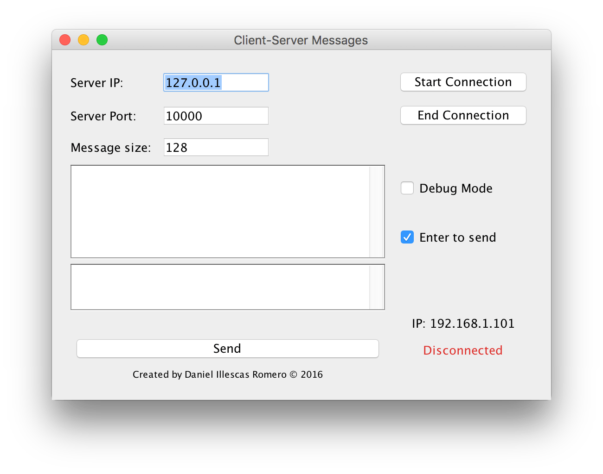

#ClientServerUDP-Java

UDP java client-server with GUI. The project was made using [IntelliJ IDEA](https://www.jetbrains.com/idea/)

Screenshots
----

How to run
----

1. Download the **jar** file from the [releases](https://github.com/illescasDaniel/ClientServerUDP-Java/releases) tab.
2. GUI: double click the `jar` file.
3. No GUI: 
    1. Run the command: `java -jar ClientServer.jar --noGUI` 
    2. Add parameters to specify the connection options:
        * `--client`: only run the client.
        * `--debug`: display more information
        * `--help`: display the available arguments.
        * `-ip <ip address>`: specify the sever IP.
        * `-port <port number>`: connection port.
        * `-size`: message length.
4. Send `\end` to end the connection.
        